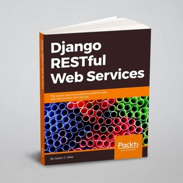

# HillarDjangoREST

**Django RESTful Web Services: The easiest way to build Python RESTful APIs and web services with Django** 

## SonarQube

## About

DRF project from - **[Django RESTful Web Services](https://www.packtpub.com/en-ru/product/django-restful-web-services-9781788833929)**

## Dependencies
- Django==5.1.7
- django-environ==0.12.0
- django-filter==25.1
- djangorestframework==3.15.2
